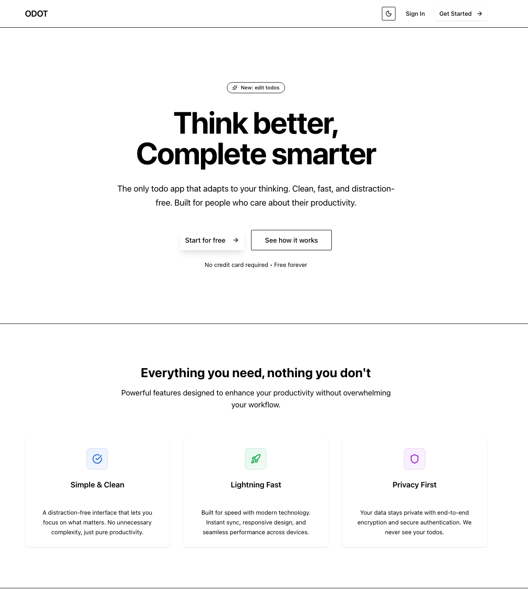
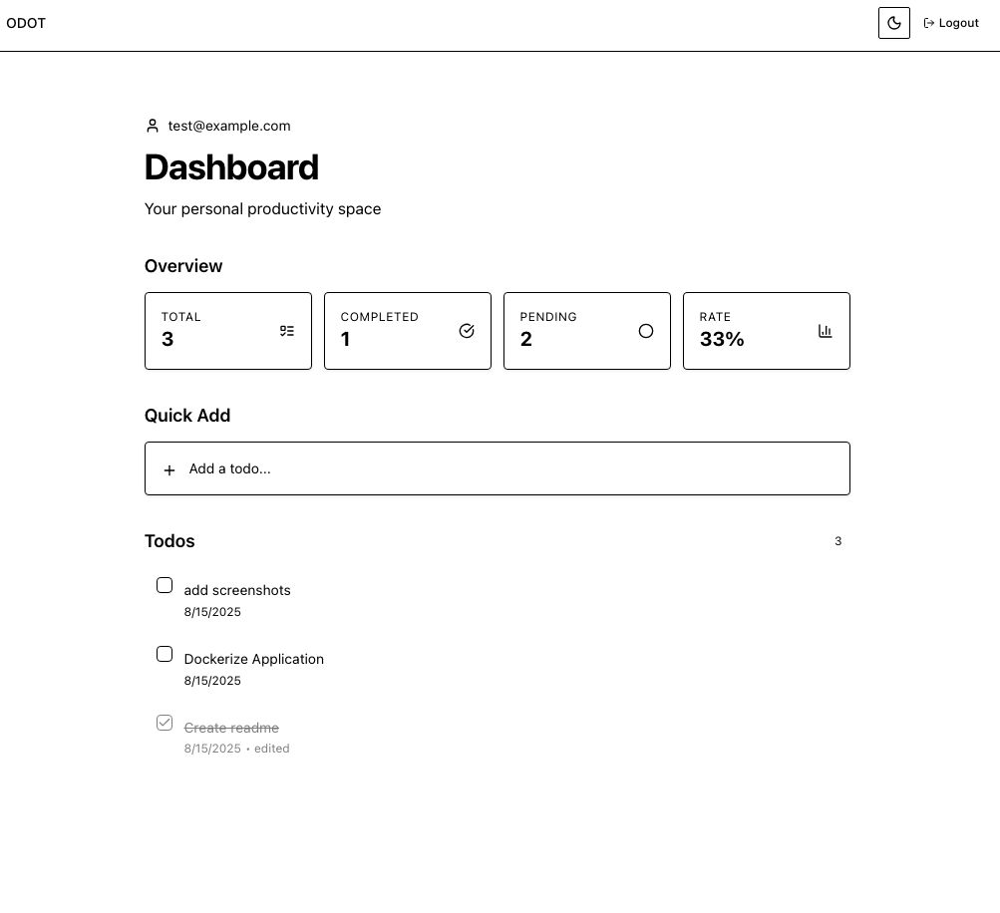
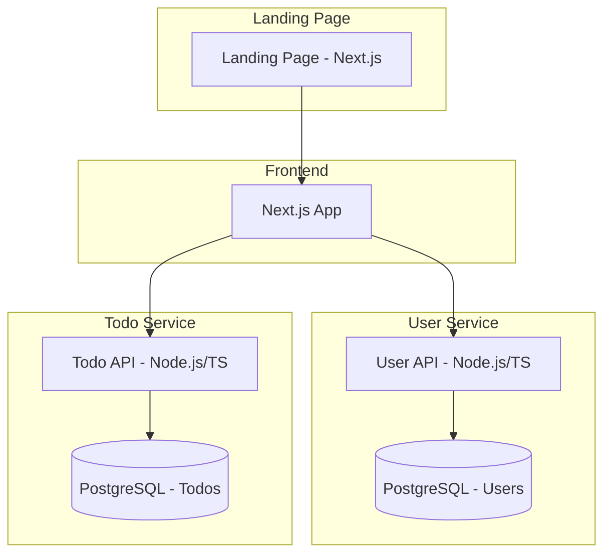

# ODOT APP

  

## Overview

  

### Description

ODOT is a full-stack, containerized web application that combines **user authentication** and **personal todo management**.

It was originally built as part of a technical challenge, but developed further as a **real product** with a polished UI and a landing page.

The app runs as multiple services with dedicated databases, all orchestrated via Docker Compose.

  

### My Approach

Rather than treating this as just another coding exercise, I approached it **with a product mindset**:

-  **Added a landing page** to give the app a real-world feel and showcase branding potential.

- Made sure the solution can evolve into a SaaS-like product.

  

### Screenshots
   
 

---

  
## AI Usage

AI was **only** used for:

- README generation
- Code beautification & formatting
- Code comments
- UI theme variable suggestions
- Landing page text refinement
- Some architecture decisions 

_No AI was used for actual core logic implementation._

---


## Architecture



  

---

  

## Techstack

-  **Frontend:** Next.js, TypeScript, TailwindCSS

-  **Backend:** Node.js, TypeScript, Express

-  **Database:** PostgreSQL

-  **Auth:** JWT (JSON Web Tokens)

-  **Containerization:** Docker, Docker Compose

-  **API Documentation:** Swagger / OpenAPI

  

---

  

## API Docs

Detailed API documentation can be found in:

-  `{api_url}/docs`

- OpenAPI schema: `docs/openapi.yaml`

  

---

  

## Getting Started

  

### Prerequisites

- Docker & Docker Compose
- Node.js (v18+)
- pnpm or npm

  

### Steps

```bash

# 1. Clone repository
git  clone  https://github.com/yourusername/odot-app.git
cd  odot-app

# 2. Start containers
docker-compose  up  --build

# 3. Access frontend
App: http://localhost:3000
User Service: http://localhost:3001
Todo Service: http://localhost:3002
```


###  Note

This project is made for **AICI GmbH**'s interview case. 