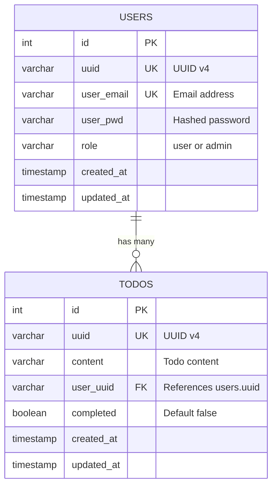

# ODOT Backend

Node.js microservice## 🚀 Quick Start

```bash
# Start individual services
cd user-service
npm install
npm run dev

cd todo-service
npm install
npm run dev

# Access services
# User Service: http://localhost:3001
# Todo Service: http://localhost:3002
# API Docs: http://localhost:3001/docs & http://localhost:3002/docs
```
```
backend/
├── user-service/     # Authentication & user management (Port 3001)
└── todo-service/     # Todo CRUD operations (Port 3002)

```

## 🚀 Tech Stack

- **Node.js 18** + **TypeScript**
- **Express.js** for REST APIs
- **PostgreSQL** databases
- **JWT** authentication
- **bcrypt** password hashing
- **Docker** containerization

## 📁 Services


### User Service (Port 3001)
- ✅ User registration & login
- ✅ JWT token generation
- ✅ Password hashing with bcrypt
- ✅ PostgreSQL integration
- ✅ Swagger documentation

### Todo Service (Port 3002)
- ✅ Todo CRUD operations
- ✅ JWT token validation
- ✅ User-specific todos
- ✅ Todo statistics
- ✅ PostgreSQL integration

## � Quick Start

```bash

# Access services
# User Service: http://localhost:3001
# Todo Service: http://localhost:3002
# API Docs: http://localhost:3001/docs & http://localhost:3002/docs
```

## 🗄️ Database Schema



## � Key Endpoints

### User Service
```
POST /api/auth/register  # User registration
POST /api/auth/login     # User login
GET  /api/admin/users    # Get all users (admin)
PUT  /api/admin/users/:id/role  # Update user role
DELETE /api/admin/users/:id     # Delete user
```

### Todo Service
```
GET    /api/todos        # Get user todos
POST   /api/todos        # Create todo
PUT    /api/todos/:id    # Update todo
DELETE /api/todos/:id    # Delete todo
GET    /api/todos/stats  # Get todo statistics
```

## � Development

```bash
# Individual service development
cd user-service
npm install
npm run dev

cd todo-service
npm install
npm run dev
```

## 🧪 Testing

```bash
# Run tests for each service
cd user-service && npm test
cd todo-service && npm test
```

## 🔒 Security

- JWT-based authentication
- bcrypt password hashing (12 rounds)
- Rate limiting
- CORS configuration
- Security headers (Helmet.js)
- Input validation

## 🐳 Docker

```bash
# Build and run individual services
docker build -t user-service ./user-service
docker build -t todo-service ./todo-service

# Or use compose for full stack
docker-compose up --build
```

## � Health Checks

- User Service: `GET /health`
- Todo Service: `GET /health`

## � Environment Variables

```env
# User Service
PORT=3001
JWT_SECRET=your-secret-key
DB_HOST=localhost
DB_PORT=5434
DB_NAME=user_db
DB_USER=postgres
DB_PASSWORD=password

# Todo Service  
PORT=3002
JWT_SECRET=your-secret-key
DB_HOST=localhost
DB_PORT=5435
DB_NAME=todo_db
DB_USER=postgres
DB_PASSWORD=password
```

---
