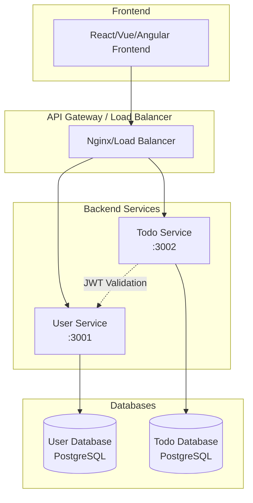
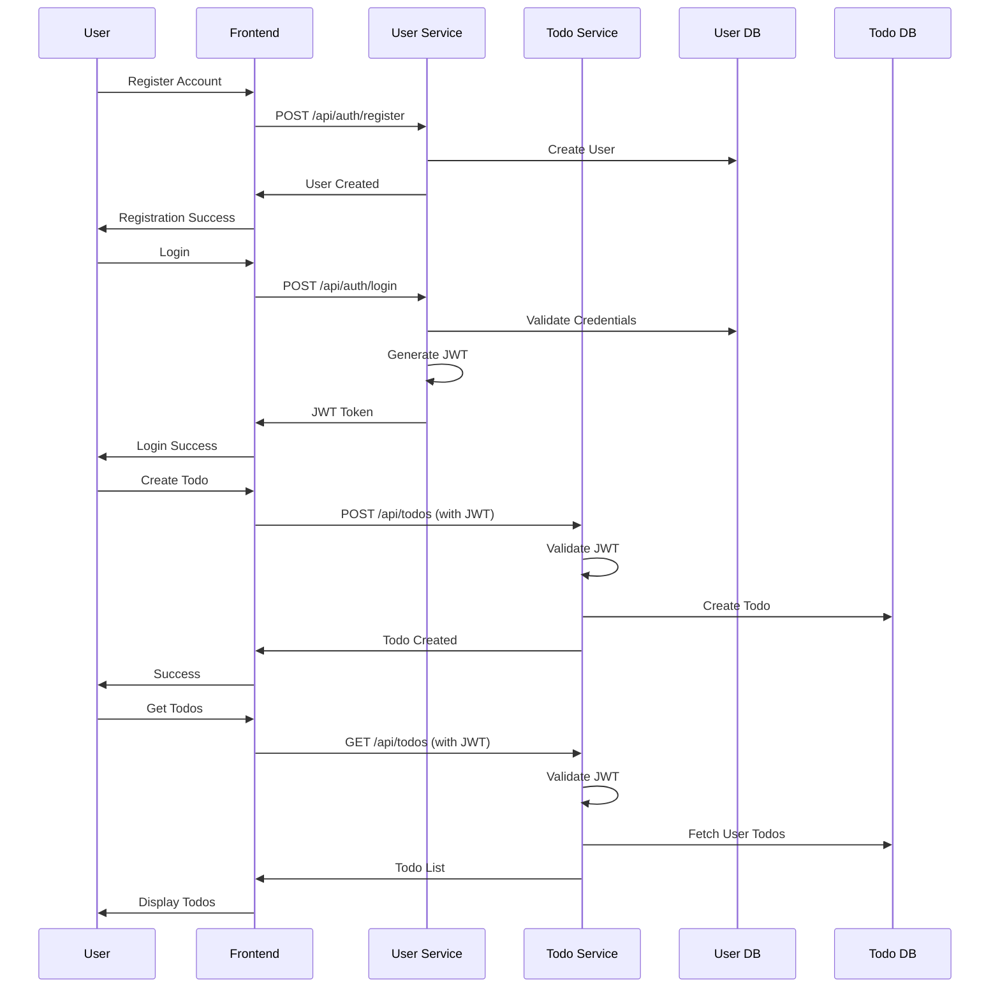
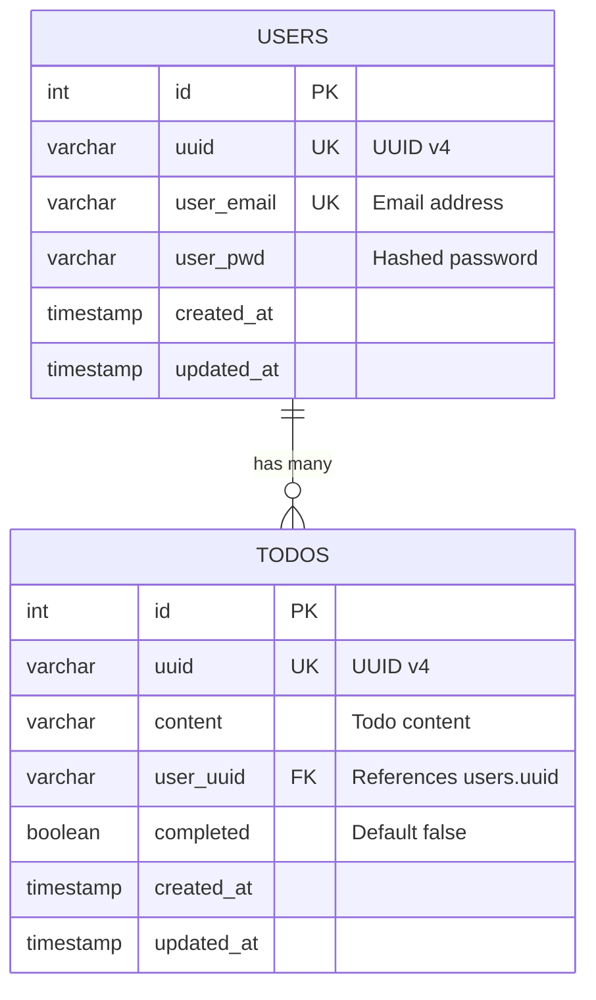

# ODO Todo App - Backend Services

This is the backend system for the ODO Todo application, consisting of microservices built with Node.js, TypeScript, and PostgreSQL. The architecture follows modern best practices with containerized services, JWT-based authentication, and comprehensive API documentation.

## 🏗️ Architecture Overview



## 🚀 System Flow



## 📋 Services Overview

### User Service (`user-service/`)
**Port:** 3001  
**Purpose:** Authentication and user management

- ✅ User registration with email validation
- ✅ User login with JWT token generation  
- ✅ Password hashing with bcrypt (12 rounds)
- ✅ Rate limiting and security middleware
- ✅ PostgreSQL database integration
- ✅ Comprehensive unit tests (13 tests)
- ✅ Swagger/OpenAPI documentation
- ✅ Docker containerization
- ✅ Health check endpoint

**Key Endpoints:**
- `POST /api/auth/register` - User registration
- `POST /api/auth/login` - User authentication
- `GET /health` - Service health check
- `GET /api-docs` - Swagger documentation

### Todo Service (`todo-service/`)
**Port:** 3002  
**Purpose:** Todo CRUD operations with JWT validation

- 🚧 **[TODO]** CRUD operations for todos
- 🚧 **[TODO]** JWT token validation middleware
- 🚧 **[TODO]** User-specific todo filtering
- 🚧 **[TODO]** PostgreSQL database integration
- 🚧 **[TODO]** Unit tests
- 🚧 **[TODO]** Swagger documentation
- 🚧 **[TODO]** Docker containerization

**Planned Endpoints:**
- `GET /api/todos` - Get user's todos
- `POST /api/todos` - Create new todo
- `PUT /api/todos/:id` - Update todo
- `DELETE /api/todos/:id` - Delete todo

## 🗄️ Database Schema



## 🛠️ Technology Stack

### Backend Framework
- **Node.js** - Runtime environment
- **TypeScript** - Type-safe JavaScript
- **Express.js** - Web framework

### Database
- **PostgreSQL** - Primary database
- **pg** - PostgreSQL client

### Authentication & Security
- **JWT (jsonwebtoken)** - Token-based authentication
- **bcrypt** - Password hashing
- **helmet** - Security headers
- **cors** - Cross-origin resource sharing
- **express-rate-limit** - Rate limiting

### Documentation
- **Swagger/OpenAPI 3.0** - API documentation
- **swagger-ui-express** - Interactive API docs

### Testing & Quality
- **Jest** - Testing framework
- **ts-jest** - TypeScript testing
- **ESLint** - Code linting

### DevOps
- **Docker** - Containerization
- **Docker Compose** - Multi-container orchestration

## 🚦 Getting Started

### Prerequisites
- Node.js 18+
- Docker & Docker Compose
- PostgreSQL (if running locally)

### Quick Start with Docker

1. **Clone the repository**
   ```bash
   git clone <repository-url>
   cd odotapp/backend
   ```

2. **Start all services**
   ```bash
   docker-compose up -d
   ```

3. **Access the services**
   - User Service: http://localhost:3001
   - User API Docs: http://localhost:3001/api-docs
   - Todo Service: http://localhost:3002 *(when implemented)*

### Development Setup

1. **User Service**
   ```bash
   cd user-service
   npm install
   cp .env.example .env
   # Edit .env with your database credentials
   npm run dev
   ```

2. **Todo Service**
   ```bash
   cd todo-service
   # Implementation coming soon...
   ```

## 📊 API Documentation

Each service provides comprehensive API documentation via Swagger UI:

- **User Service**: http://localhost:3001/api-docs
- **Todo Service**: http://localhost:3002/api-docs *(coming soon)*

The documentation includes:
- Interactive API testing
- Request/response schemas
- Authentication examples
- Error code explanations

## 🧪 Testing

### Run All Tests
```bash
# User Service
cd user-service
npm test

# Todo Service (when implemented)
cd todo-service
npm test
```

### Test Coverage
```bash
npm run test:coverage
```

## 🔒 Security Features

- **JWT-based authentication** with secure token generation
- **Password hashing** using bcrypt with 12 salt rounds
- **Rate limiting** to prevent abuse
- **CORS configuration** for cross-origin requests
- **Security headers** via Helmet.js
- **Input validation** and sanitization
- **SQL injection protection** via parameterized queries

## 🐳 Docker Deployment

### Individual Services
```bash
# User Service
cd user-service
docker build -t user-service .
docker run -p 3001:3001 user-service

# Todo Service (when implemented)
cd todo-service
docker build -t todo-service .
docker run -p 3002:3002 todo-service
```

### Full Stack Deployment
```bash
# From backend root directory
docker-compose up -d
```

## 📈 Monitoring & Health Checks

Each service provides health check endpoints:
- User Service: `GET /health`
- Todo Service: `GET /health` *(coming soon)*

Health checks include:
- Service status
- Database connectivity
- Timestamp information

## 🗂️ Project Structure

```
backend/
├── user-service/                 # Authentication service
│   ├── src/
│   │   ├── controllers/          # Request handlers
│   │   ├── models/              # Database models
│   │   ├── routes/              # API routes
│   │   ├── middleware/          # Custom middleware
│   │   ├── config/              # Configuration files
│   │   ├── types/               # TypeScript definitions
│   │   └── __tests__/           # Unit tests
│   ├── Dockerfile
│   ├── docker-compose.yml
│   └── package.json
├── todo-service/                 # Todo management service (TBD)
│   └── [To be implemented]
├── docker-compose.yml            # Multi-service orchestration
└── README.md                     # This file
```

## 🚧 Development Roadmap

### ✅ Completed
- [x] User Service complete implementation
- [x] JWT authentication system
- [x] PostgreSQL integration
- [x] Unit testing (13 tests passing)
- [x] Swagger API documentation
- [x] Docker containerization
- [x] Security middleware implementation

### 🔄 In Progress
- [ ] Todo Service implementation
- [ ] Service-to-service communication
- [ ] Integration tests

### 📅 Planned
- [ ] API Gateway implementation
- [ ] Logging and monitoring
- [ ] CI/CD pipeline
- [ ] Performance optimization
- [ ] Production deployment guides

## 🤝 Contributing

1. Follow TypeScript best practices
2. Write comprehensive tests
3. Update API documentation
4. Ensure Docker builds work
5. Follow conventional commit messages

## 📝 Environment Variables

### User Service
```env
PORT=3001
JWT_SECRET=your-super-secret-jwt-key
DB_HOST=localhost
DB_PORT=5432
DB_NAME=user_db
DB_USER=postgres
DB_PASSWORD=password
NODE_ENV=development
```

### Todo Service *(when implemented)*
```env
PORT=3002
JWT_SECRET=your-super-secret-jwt-key  # Same as User Service
DB_HOST=localhost
DB_PORT=5432
DB_NAME=todo_db
DB_USER=postgres
DB_PASSWORD=password
USER_SERVICE_URL=http://localhost:3001
NODE_ENV=development
```

---

**Status**: User Service ✅ Complete | Todo Service 🚧 In Development

For detailed service-specific documentation, see individual README files in each service directory.